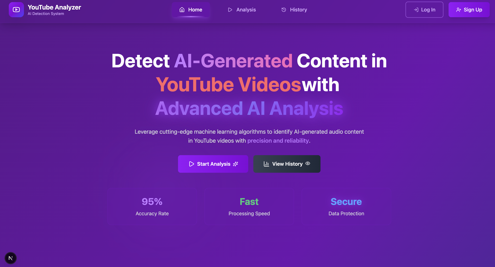
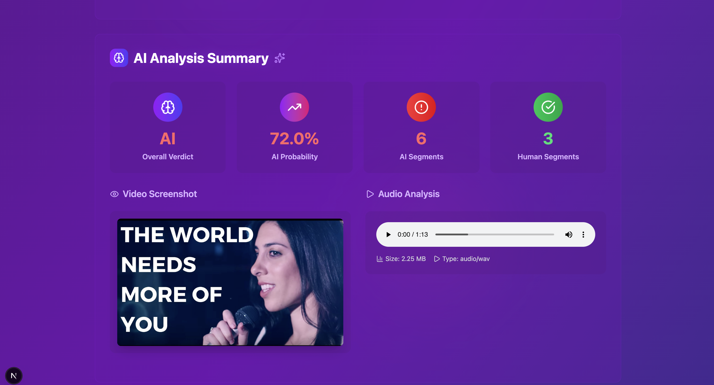
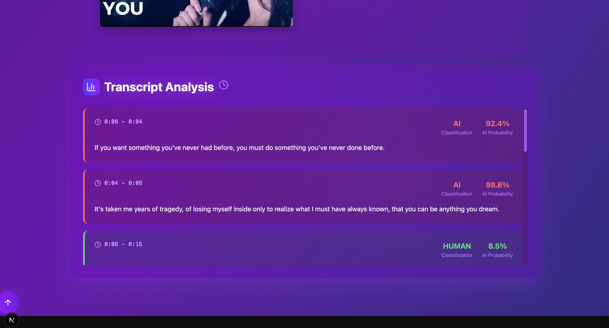
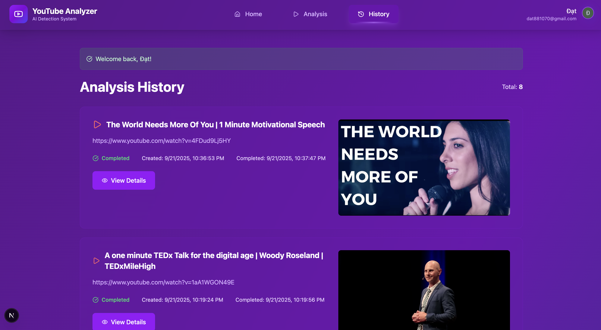
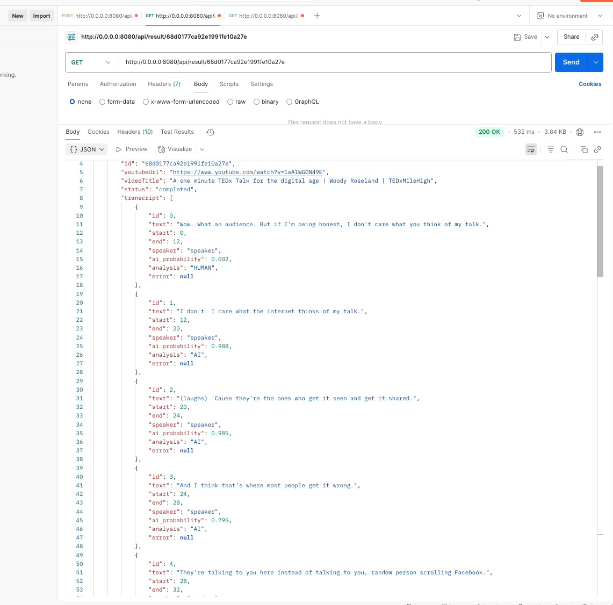
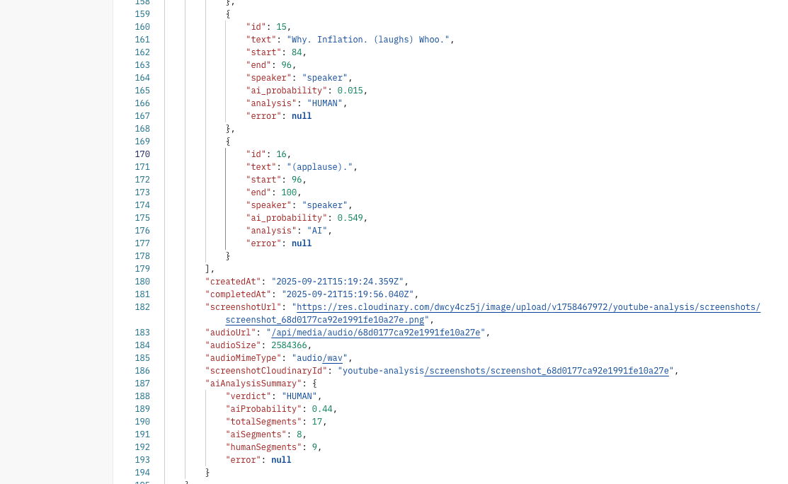

# 🎥 YouTube Analysis Project  

A **full-stack web application** for analyzing YouTube videos.  
Users can submit YouTube URLs, generate transcripts, run AI-powered analysis, and track their analysis history.  

---

## 📌 Table of Contents  
- [Introduction](#introduction)  
- [Features](#features)  
- [Screenshots](#screenshots)  
- [Project Structure](#project-structure)  
- [Setup](#setup)  
- [Environment Variables](#environment-variables)  
- [Running with Docker](#running-with-docker)  

---

## 🌟 Introduction  

This project is designed to help users analyze YouTube videos through automated audio extraction, transcription, and AI analysis.  
It is built with **Next.js (frontend)** and **Node.js + Express.js (backend)**, with support for containerized deployment via Docker.  

---

## 🚀 Features  

- **Home Page**: Landing page with an introduction to the service.  
- **Analyze Page**: Submit a YouTube URL and view results.  
- **History Page**: View analysis history of previously submitted videos.  
- **Backend Processing**: Extracts audio, transcribes content, and runs AI-based insights.  
- **Responsive Design**: Optimized for both desktop and mobile.  
- **Dockerized Deployment**: Easy setup using Docker Compose.  

---

## 🖼️ UX/UI  


  

  
  
  

  
  


## 📂 Project Structure  

The project is divided into two main parts:  

```
Youtube_Analysis/
│
├── client/    # Frontend (Next.js)
│
├── server/    # Backend (Node.js + Express.js)
│
├── docker-compose.yml
└── README.md
```  

- **Client (Next.js)**: Provides the user interface, communicates with backend via REST API.  
- **Server (Express.js)**: Handles video processing, audio transcription, and AI analysis.  

---

## ⚙️ Setup  

### 1. Clone the repository  
```bash
git clone https://github.com/DatTran0509/Youtube_Analyse.git
cd Youtube_Analysis
```  

### 2. Install dependencies  
For both server and client:  
```bash
cd server && npm install
cd client && npm install
```  

---

## 🔑 Environment Variables  

### Server `.env`  
```bash
MONGODB_URI=mongodb+srv://...
ELEVEN_LABS_API_KEY=YOUR_API_KEY
ELEVEN_LABS_API_URL=https://api.elevenlabs.io/v1/audio-to-text
SAPLING_API_KEY=YOUR_API_KEY
SAPLING_API_URL=https://api.sapling.ai/api/v1/aidetect
CLOUDINARY_CLOUD_NAME=YOUR_API_KEY
CLOUDINARY_API_KEY=YOUR_API_KEY
CLOUDINARY_API_SECRET=YOUR_API_KEY
CLIENT_URL=http://localhost:3000
CLERK_PUBLISHABLE_KEY=YOUR_API_KEY
CLERK_SECRET_KEY=YOUR_API_KEY
SCREENSHOT_API_KEY=YOUR_API_KEY
PORT=8080
```  

## Client `.env`  
bash
NEXT_PUBLIC_CLERK_PUBLISHABLE_KEY=YOUR_API_KEY
CLERK_SECRET_KEY=YOUR_API_KEY
NEXT_PUBLIC_BACKEND_URL=http://server:8080
``` 
```
💡 **Note**:  
- If you want to run locally (without Docker), update your Client `.env` file:  
```bash
NEXT_PUBLIC_BACKEND_URL=http://0.0.0.0:8080
```  
- Then run the applications manually:  
```bash
cd server && npm run dev
cd ../client && npm run dev
``` 

---

## 🐳 Running with Docker  

### 1. Build and run the containers  
```bash
docker-compose up --build
```  

### 2. Access the application  
- **Client**: [http://localhost:3000](http://localhost:3000)  
- **Server**: [http://0.0.0.0:8080](http://0.0.0.0:8080)  
